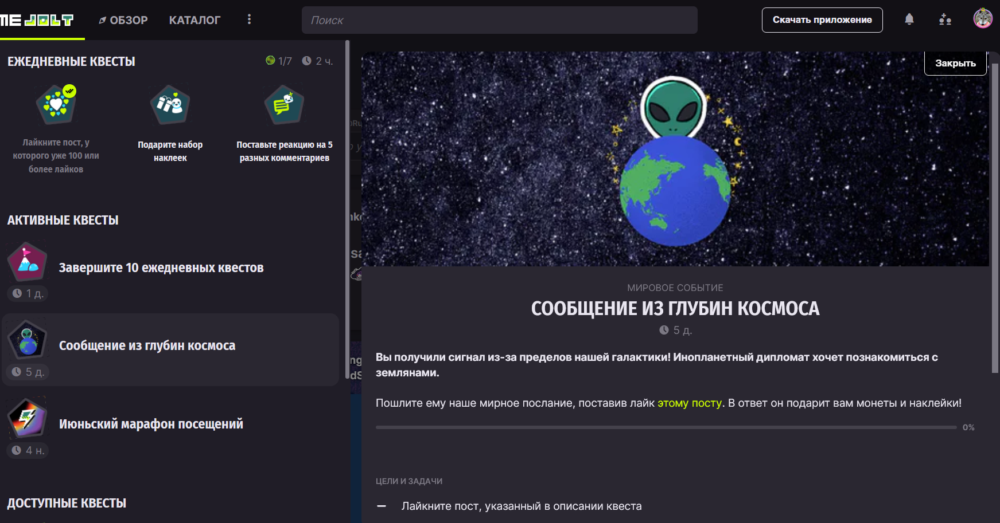

# Русификатор Game Jolt

    

 

Русификатор [Game Jolt](https://gamejolt.com/), реализованный в виде скрипта для [Tampermonkey](https://github.com/Tampermonkey/tampermonkey).

Текущая версия: **0.4 Indev.**

## Установка

1. Установите Tampermonkey
2. Откройте ссылку на скрипт c [GitHub](https://github.com/RushanM/GameJolt-Russian-Translation/raw/main/%D0%A0%D1%83%D1%81%D0%B8%D1%84%D0%B8%D0%BA%D0%B0%D1%82%D0%BE%D1%80%20Game%20Jolt.user.js) или [GreasyFork](https://greasyfork.org/ru/scripts/496844-game-jolt-russian-translation)
3. Обновите страницу Game Jolt, если она была открыта
4. Готово!

## Материальная поддержка
Если моя работа нравится вам настолько, что вы готовы отправить мне деньги, можно сделать это по следующим ссылкам:
* [Boosty](https://boosty.to/rushanm)
* [VK Pay](https://vk.me/moneysend/deflecta)
* [Donation Alerts](https://www.donationalerts.com/r/deflecta)
* [ЮMoney](https://yoomoney.ru/to/410015215253910)

Буду благодарен за каждый рубль!